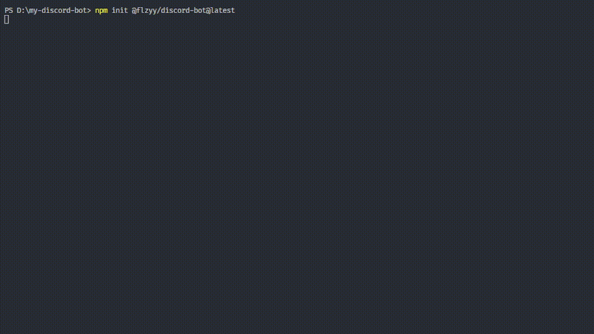

# create-discord-bot

[](https://www.npmjs.com/package/@flzyy/create-discord-bot)
[](https://www.npmjs.com/package/@flzyy/create-discord-bot)
[](https://www.npmjs.com/package/@flzyy/create-discord-bot)
[](https://www.codefactor.io/repository/github/create-discord-bot/create-discord-bot)

CLI tool to bootstrap your discord.js bot with
[Typescript](https://www.npmjs.com/package/typescript) or just default Javascript.

## Features

- Easy to use CLI tool.
- Options between [Typescript](https://www.npmjs.com/package/typescript) and Javascript.
- Ability to add ESLint/Prettier in one click.
- Option to use [Pino](https://github.com/pinojs/pino) or the default (console.log/error/warn) logger.
- 4 Dependencies and only a few kilobytes unpacked, this makes it extremely fast to download and use.

## Usage

Simply run the following command and answer all of the prompts. [Learn more](https://create-discord-bot.github.io/)

```bash
npm init @flzyy/discord-bot@latest # or npx @flzyy/create-discord-bot@latest
```


